# Obsidian For Business

<!-- Header & Preview Image -->

  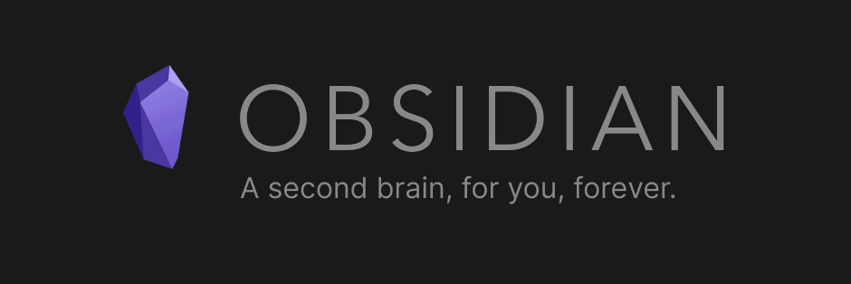

<!-- Shields -->

  
  
  
  
  

<!-- Description -->

> Obsidian For Business is a combination of a template vault for Obsidian and some Microsoft Outlook VBA Macros. Together, these facilitate a powerful, extensible, and flexible plain text workflow using Microsoft Office and Obsidian.

**If you enjoy this product and want to support it's development consider GitHub Sponsorship:**

<!-- GitHub Sponsor -->
<h3 align="center">
    <a href="https://github.com/sponsors/tallguyjenks" target="_blank">👉 Sponsor this Work 👈</a>
</h3>

## Table of Contents

- [Obsidian For Business](#obsidian-for-business)
  - [Table of Contents](#table-of-contents)
  - [Features](#features)
  - [Requirements](#requirements)
    - [Recommended](#recommended)
  - [Installation](#installation)
    - [Getting the Outlook Utilities Installed](#getting-the-outlook-utilities-installed)
    - [Users](#users)
    - [Contributors](#contributors)
  - [Usage](#usage)
    - [Example](#example)
  - [Documentation](#documentation)
  - [Resources](#resources)
  - [Development](#development)
    - [Security](#security)
    - [Future](#future)
    - [History](#history)
    - [Community](#community)
  - [Credits](#credits)
  - [License](#license)

## Features

[Return To Top](#table-of-contents)

- A template vault to get you started using `Obsidian For Business`
- Easy macros for tagging and refactoring emails en-masse
  - Select email(s) in Outlook and run the `JDAdd` macro to add a Johnny Decimal tag like: `12.04`. Your email subject lines will get a `[12.04]` tag added to the end of the subject line for easy searching. Described more in detail [HERE](https://johnnydecimal.com/concepts/managing-email/)
  - To easily remove an entire tag from email(s) select them all and run `JDRemove` and 1 tag will be removed from the end of the subject line
  - Conversation view groups will not display the tag only the individual email items
- Extract emails and calendar meetings to plain text straight to your vault
  - Select email(s) in Outlook and run the `SaveEmail` utility to extract each email into the designated folder in our Obsidian vault. (file path configured in [USER_CONFIG](USER_CONFIG.vb)
  - Extract meeting attdendees and details by selecting a single meeting at a time in the calendar interface and running `SaveMeeting` and the detailes will be extracted to the designated vault file path set in [USER_CONFIG](USER_CONFIG.vb) 
- Several facets of this system are configured and documented in [USER_CONFIG](USER_CONFIG.vb)

## Requirements

[Return To Top](#table-of-contents)

- Obsidian is required for the Template Vault
- For the Microsoft Outlook VBA tools you will need:
  - Microsoft Windows
  - Microsoft Office
  - [Microsoft Outlook Macros Enabled](https://support.microsoft.com/en-us/office/enable-or-disable-macros-in-office-files-12b036fd-d140-4e74-b45e-16fed1a7e5c6)
  - Microsoft Office VBA libraries activated
    - Microsoft Forms 2.0 Object Library
    - Microsoft VBScript Regular Expressions 5.5

### Recommended

[Return To Top](#table-of-contents)

It is recommended to use the latest version of Obsidian. The template vault includes community plugins. These should be updated to their latest versions using Obsidian's settings, the first time you open the vault.

## Installation

[Return To Top](#table-of-contents)

1. Download this GitHub repository through any of the usual means 
   - GitHub CLI
   - SSH
   - HTTPS
   - a `.zip` etc.
2. Take the `TEMPLATE_VAULT/` directory and move or rename it however you'd like it for your [Obsidian](https://obsidian.md/ vault
3. Open that folder in Obsidian as a new vault
4. Explore, play, find out what works and doesn't and change what ever you'd like

### Installing the Outlook Utilities

1. Open Outlook
2. Press & hold <kbd>Alt</kbd> then press <kbd>f11</kbd>. The Visual Basic Editor will open. You'll see something that looks like this: 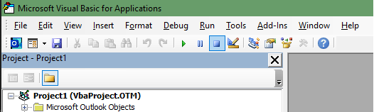
3. The first thing we need to do is activate some library references. Go to `Tools > References`.  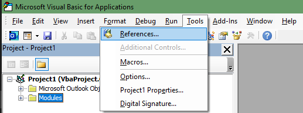
4. The "References" dialog will open, shown below. 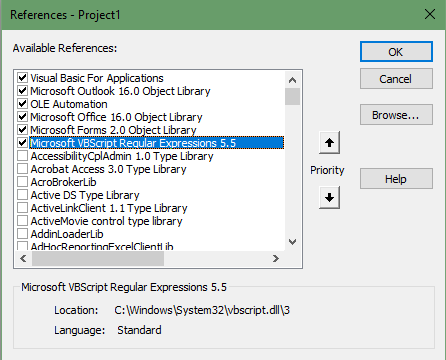
5. Ensure all these items are selected. The 2 necessary ones are:
    - Microsoft Forms 2.0 Object Library
    - Microsoft VBScript Regular Expressions 5.5
If you cant find exact versions like `Microsoft Office 16.0 Object Library` don't worry, your version of Outlook/Office may not use these. Select whatever similar versions are available. (Issues with these tools are unlikely, but if you encounter any, please [file a bug report](https://github.com/tallguyjenks/Obsidian-For-Business/issues/new?assignees=&labels=bug&template=BUG_REPORT.md&title=).)

6. Next we need to get the code into the Outlook Application. For this, you'll need the `.vb` files located in the `VBA Utilities` folder of this repository. You'll copy/paste the code from these macros to use them in Outlook.
7. To start, open the 'Insert Module' dropdown depicted below. Select `Module` then paste in the contents of a `.vb` file. Do this for each macro you want to use, but `USER_CONFIG` and `SaveUtilities` are required. 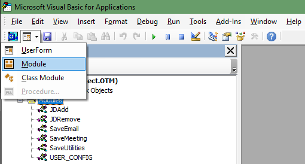
8. You'll need to change the name of each new module. To do this, use the `Properties` window shown below. It should automatically be visible when you open the Editor with the hotkey combo from earlier. Name the modules exactly as you see listed below. (Names should match the original filenames, minus the extension so use `SaveMeeting` for what you pasted from `SaveMeeting.vb`)  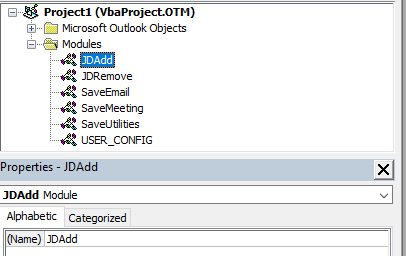
9. Open the `USER_CONFIG` module and edit the `vaultPathToSaveFileTo` variable with the absolute path where you want your files to be sent. You must use a trailing backslash at the end of the path `\`

These steps enable the basic functionality of the macros but you can customize a friendlier setup. See [Usage](#usage).

## Usage

[Return To Top](#table-of-contents)

After installing the Outlook utilities, you can make them friendlier to use, thanks to the `Quick Access Toolbar in Outlook`.

1. At the top of your Outlook application there will be a little down arrow icon and some other icons in the top left of the application. 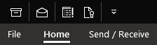
2. Click the down arrow and select the `More Commands` option 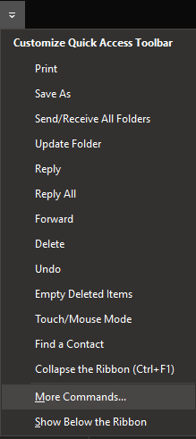
3. You'll get a screen that looks similar to this, under the `Choose commands from` drop down select `Macros` and you'll see a list of the code files we added.
4. because of the way VBA works you cant name the functions the same as the modules so thats why the names differ but it should be fairly obvious which are which.
5. Select the macro items and click the `Add >>` button to move them to the Quick Access Toolbar menu (`<Separators>` are useful for visually separating groups of commands) 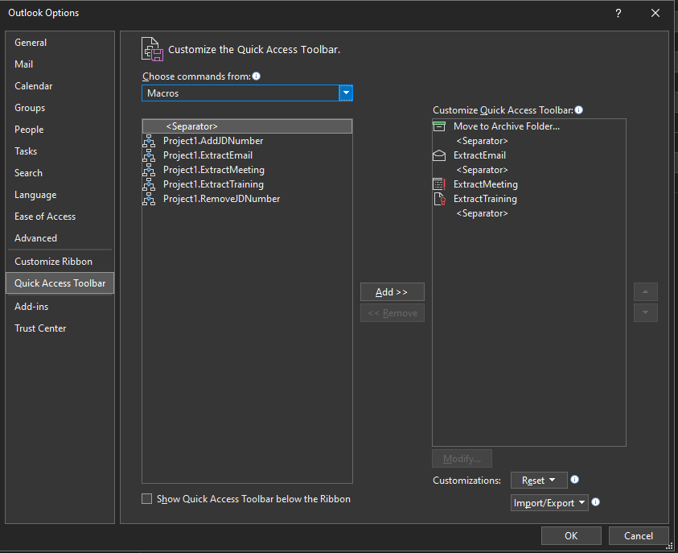
6. Now we can get a little more aesthetic and select a Macro on the right hand side of the dialog box then click `Modify...` 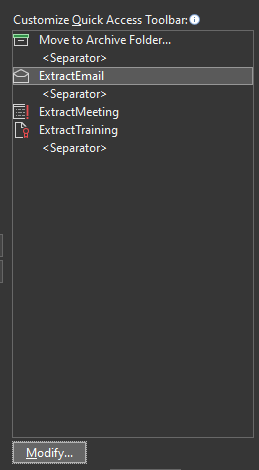
7. This will let you select a custom icon to display on the Quick Access Toolbar for the macro so they are a little more intuitive to view
8. When finished click `Ok` until all menus and windows are closed 

With that all done you'll have some icons on your Quick Access Toolbar to click for your automated actions but to take it a step further, if you simply press <kbd>Alt</kbd> the Quick Access Toolbar will highlight the icons with numbers so you can simply press a number afterwards to run the action for an entirely keyboard-centric workflow: 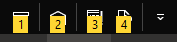

### Example

[Return To Top](#table-of-contents)

<++>

## Documentation

[Return To Top](#table-of-contents)

- See [The Wiki](https://github.com/tallguyjenks/Obsidian-For-Business/wiki)

## Resources

[Return To Top](#table-of-contents)

- [Obsidian](https://obsidian.md/)
- [Bryan's YouTube Channel (Lots of Obsidian Videos)](https://www.youtube.com/c/BryanJenksTech?sub_confirmation=1)

## Development

[Return To Top](#table-of-contents)

- Development should take place on a Windows machine.
  - Given that VBA was made in '93 legacy'd in '08 little has changed so you can still easily use older code and machines. 
  - Only thing is that the newer versions of MS Office might be recommended because of the additions to the Object Library for VBA and i'm not sure if there would be anything missing from what versions of the libraries.
- Helpful tools with VBA that I have yet ot implement well with this project are:
    <!-- TODO Implement these tools into the project -->
  - [The Rubberduck IDE](https://github.com/rubberduck-vba/Rubberduck)
  - [VBA Sync Version Control Helper](https://github.com/chelh/VBASync/) 

See [CONTRIBUTING](CONTRIBUTING.md)

### Security

[Return To Top](#table-of-contents)

- There should be no administrative privledges required for any of these tools at any time for any reason. As well as no requirement for any passwords, credentials or any user information what so ever. No data moves outside the local machine. There shouldn't be any security issues but if you think of anything please [report a security vulnerability](https://github.com/tallguyjenks/Obsidian-For-Business/security/policy).

### Future

[Return To Top](#table-of-contents)

- Ideally i'd like to further improve upon the code base using the additional VBA dev tools listed under [Development](#development) to batter manage the code.
- For now i'd like to squash bugs, expand the regex options for email formats that appear so the extractors work as intended and after reaching a level of stability, just expand feature requests.

See [ROADMAP](ROADMAP.md)

### History

[Return To Top](#table-of-contents)

- **2021-04-04** Codebase Is Opensourced!

See [RELEASES](https://github.com/tallguyjenks/Obsidian-For-Business/releases)

### Community

[Return To Top](#table-of-contents)

See [CODE OF CONDUCT](CODE_OF_CONDUCT.md)

### Contributors

[Return To Top](#table-of-contents)

None yet! But PR's welcome!

See [CONTRIBUTING](#contributing)

## Credits

[Return To Top](#table-of-contents)

- Thank you to everyone who contributes to this project.
- If you contribute to this project do add a PR for [AUTHORS](AUTHORS.md) as well!

See [AUTHORS](AUTHORS.md)

## License

[Return To Top](#table-of-contents)

See [LICENSE](LICENSE)

---

<!-- Buy me a coffee -->
<h3 align="center">

</h3>
