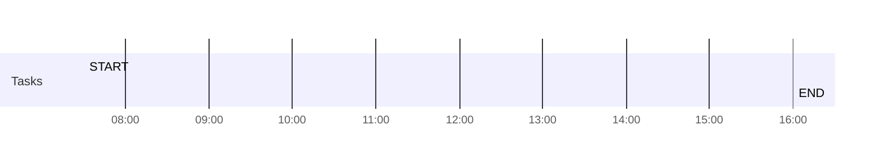

## Day Planner

- [ ] 07:30 START
- [ ] 16:00 END

## On This Day...

[[2020-<%tp.date.now("MM-DD")%>]]

---

%% This template requires the calendar plugin %%
[[<%tp.date.now("YYYY-MM-DD", -1)%>]] <== <button class="date_button_today">Today</button> ==> [[<%tp.date.now("YYYY-MM-DD", 1)%>]]

---

